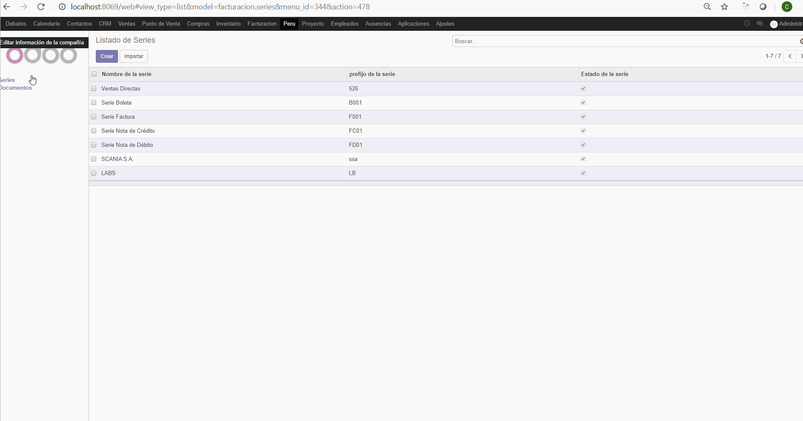
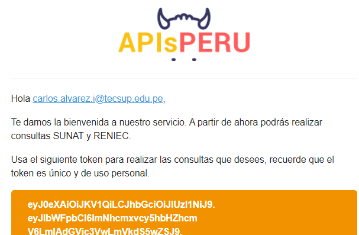

# INTEGRACIÓN DE SISTEMAS EMPRESARIALES AVANZADO 
# LABORATORIO N° 10: Consumo de API Externa

# Alumno: Carlos Enrique Alvarez Iquiapaza

2.5. Para finalizar, agregaremos la dependencia contacts (ya que luego modificaremos a los contactos del sistema) y los archivos de vista documentos.xml y documentos_view.xml dentro del manifest.py

Reiniciaremos el servicio y luego actualizaremos el módulo. Adjunte un GIF del funcionamiento de este nuevo menú Documentos, mostrando como se edita un ítem sin necesidad de abrir un formulario. 
 

4.3. En nuestra bandeja, tendremos un correo de dicho servicio con un token. Conservaremos este token para nuestro consumo respectivo.

# Conclusiones

El funcion inherit nos permite cambiar los atributos de algunos campos que existen en el modelo existente asi como para agregar,modificar o eliminar campos antiguos o nuevos en el modelo existente.

Tras la resolucion del laboratorio vimos una forma mas rapida de ingresar datos por medio de archivos xml.

Para ver los datos ingresados por medio de archivos debemos reiniciar el servicio de odoo.

Durante la realizacion del laboratorio pudimos agregar la funcion de editar los documento al modulo de facturacion

Fue necesario la realizacion de laboratorios anteriores para la comprension y realizacion de este

