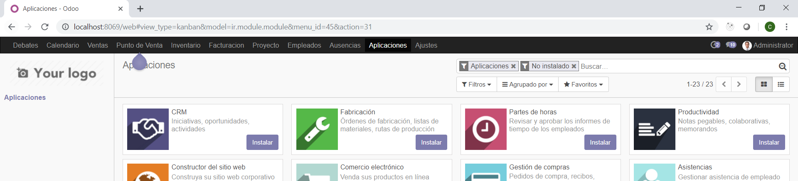
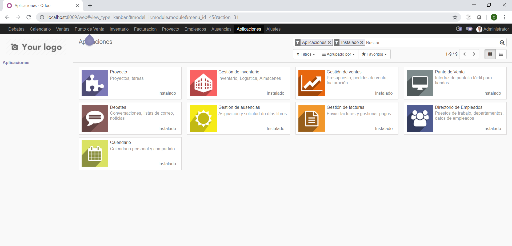
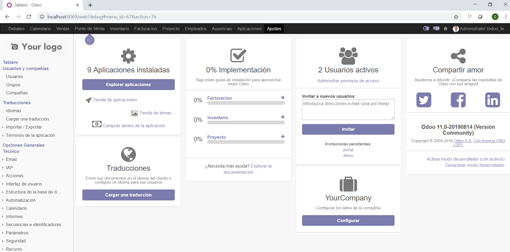
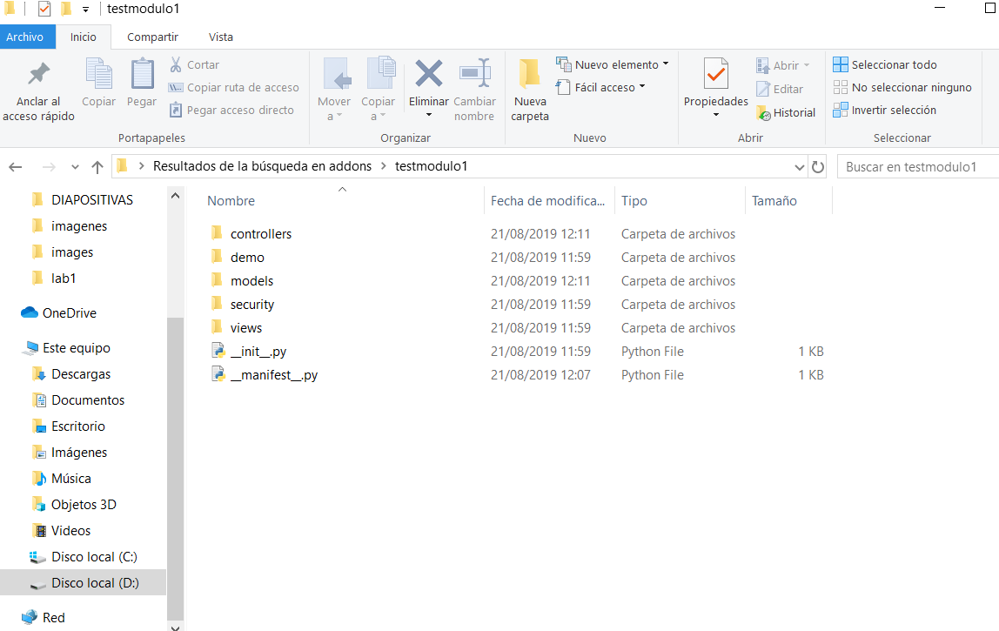
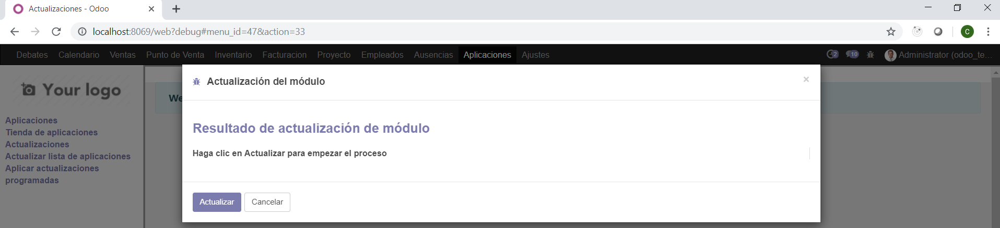
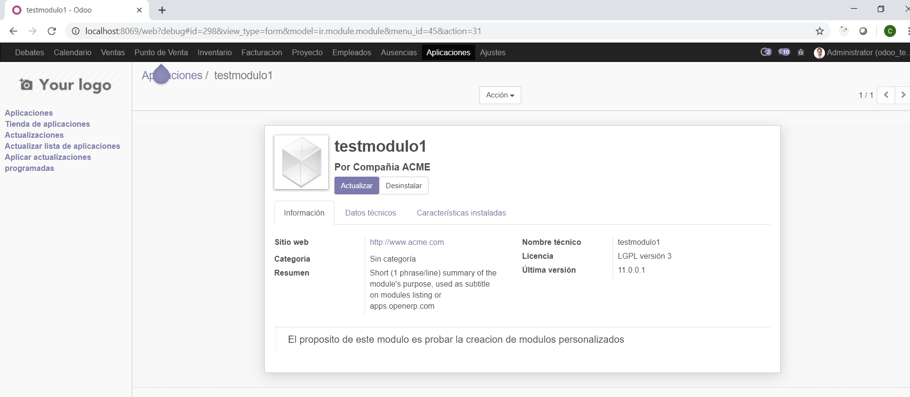

# INTEGRACIÓN DE SISTEMAS EMPRESARIALES AVANZADO 
# LABORATORIO N° 02: ADMINISTRACIÓN DE MÓDULOS ODOO

Alumno: Carlos Enrique Alvarez Iquiapaza

## Desarrollo

2.4. Observe el resultado obtenido:

2.7. Aplique los Filtros “Apps” e “instalado” simultáneamente:

4.1. Indique el nombre del módulo al que pertenece cada “Tablero” de opciones mostrado:

Gestion de ausencias
Gestion de inventario
Punto de venta

4.5. Verifique en la opción de Configuración el modo actual:

5.8. Visualice el contenido que se ha creado dentro de la carpeta testmodulo1:

5.12.  En el cuadro de diálogo. Clic en Actualizar

5.15.  En la figura anterior haga clic en el recuadro que representa a testmodulo1 y observe que ahora en los detalles del módulo se observa el botón Desinstalar

## Tarea	

1.   Elabore una descripción breve de la funcionalidad que tiene cada uno de los elementos (archivos y/o carpetas) que se han creado como parte del nuevo módulo en la siguiente tabla

__init__.py    	 Se usan para marcar directorios en el disco como directorios de paquetes Python.

__manifest__.py  Se usa para color caracteristicas del proyecto como por ejemplo nombre del proyecto, version,autor etc

controllers 	 Este modulo contiene controladores(rutas http)

demo		 Es un espacion que te brinda la facilida de probar tu modulo

models		 Se encarga de definir los modelos de nuestro proyecto

security	 Es un archivo que se encarga de la segurida del modulo y tambien deliega permisos.

views  		 Se encuentra las vistas de el modulo que estamos desarrollando

## Conclusiones y Observaciones

En el desarrollo del laboratorio nos familizariamos mas con la herramienta odoo

La herramienta odoo nos facilita la busqueda de apps por medio de filtros 

El modo desarrollador nos despliega mas opcion del menu de configuracion al activar este modo tambien nos habilida una herramienta Open Developer Tools  que es menu enfocado a los desarrolladores

Tras la resolucion del laboratorio vimos cuales son los pasos para la creacion de un proyecto en odoo 

Tras la resolucion del laboratorio vimos como es la instalacion y actualizacion de modulos en odoo

Creamos un modulo llamado testmodulo1 en el cual pudimos instalar una ves creado y ver sus caracteristicas e especificaciones del mismo

