# INTEGRACIÓN DE SISTEMAS EMPRESARIALES AVANZADO 
# LABORATORIO N° 03: CMR en ODOO

Alumno: Carlos Enrique Alvarez Iquiapaza

## Desarrollo

2.4. Clic en el link CRM para visualizar las opciones del módulo CRM

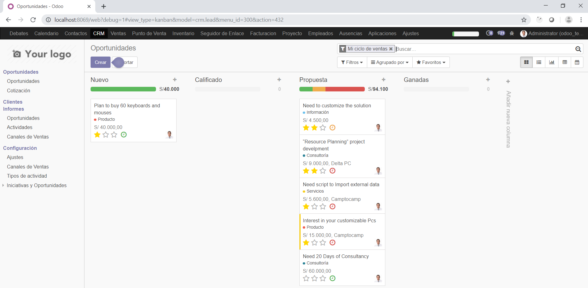

3.2. Se muestra el asistente de configuración del módulo (pantalla de bienvenida):

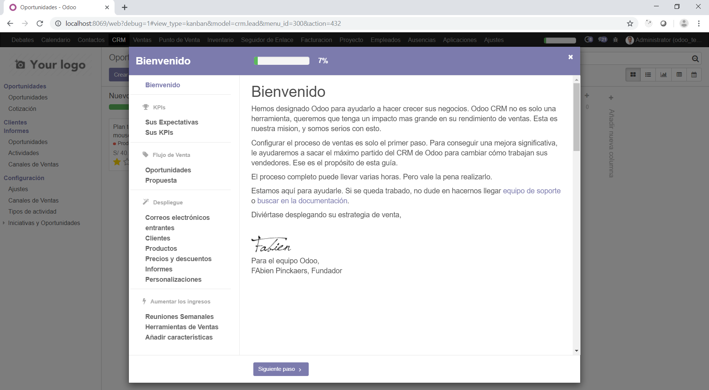

3.3. Ingrese las expectativas de su estrategia (Objetivos de ventas, retos)

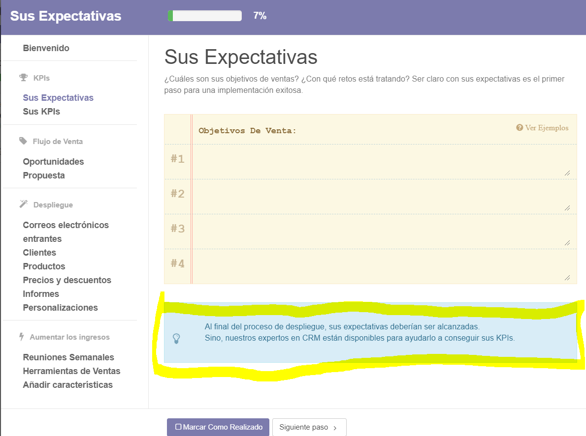

3.4. Ingrese los KPIs de su estrategia:

./images/Punto 3_4 Estrategias KPI.PNG)

3.5. Configure el flujo de trabajo para su estrategia:

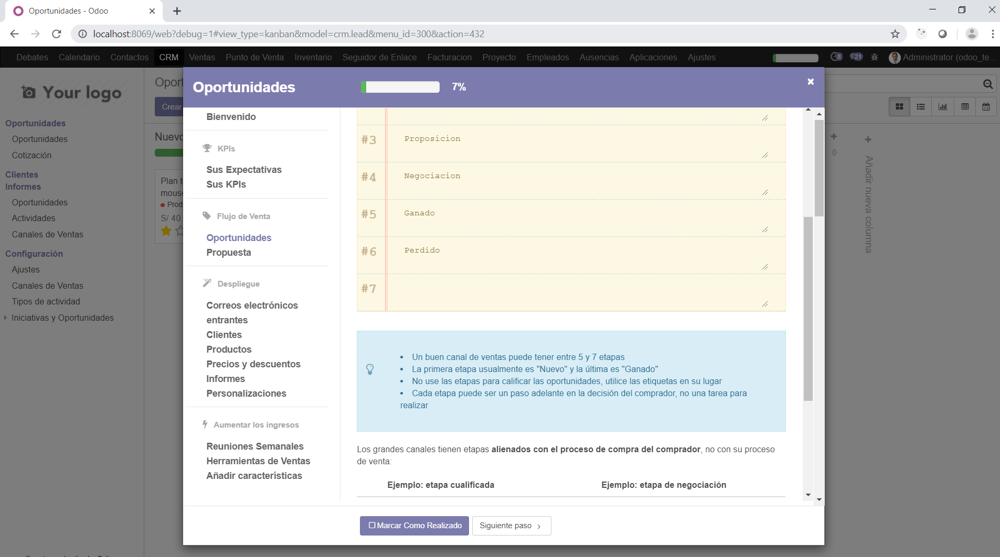

3.7. Revise las recomendaciones de la ventana: “Correos electrónicos entrantes”

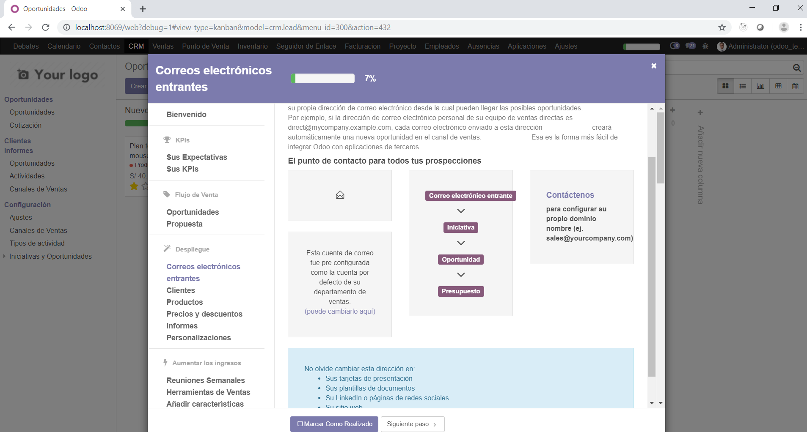

3.8. Revise las opciones disponibles para creación de Clientes

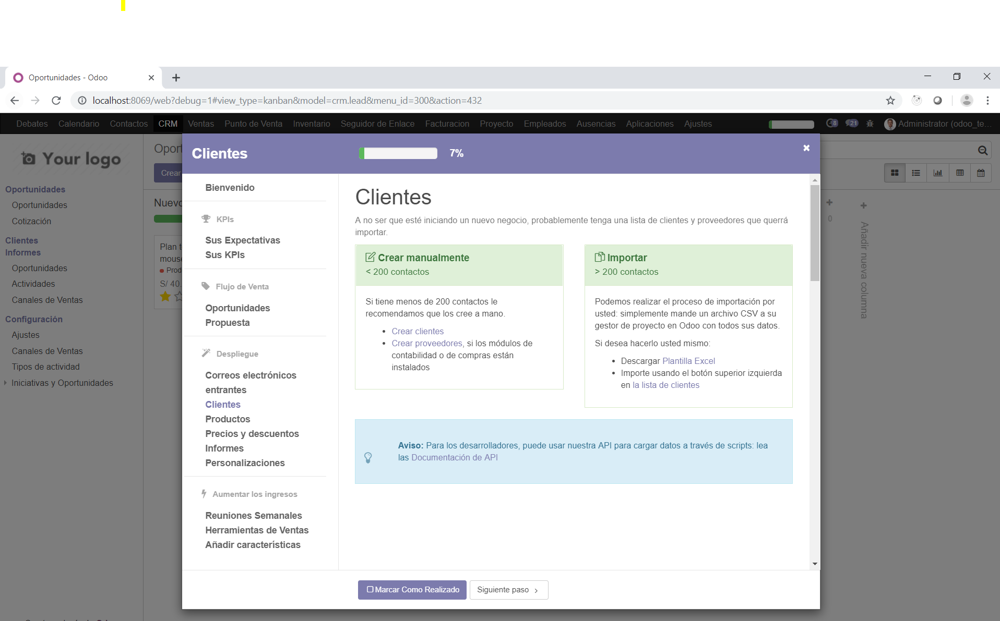

3.9. Revise las opciones disponibles para creación de Productos
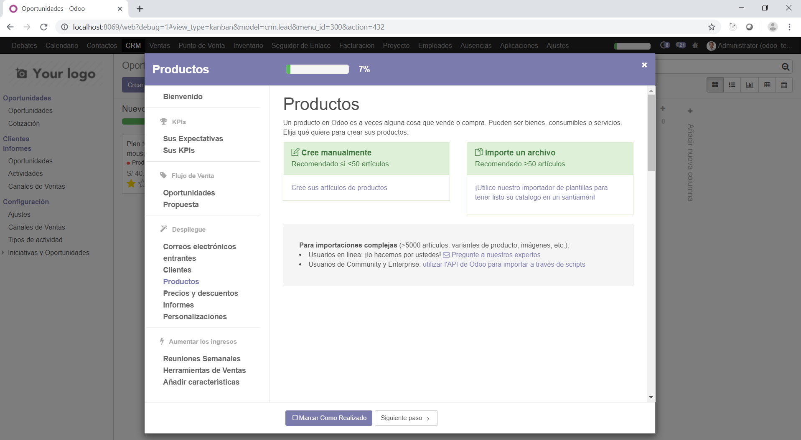

3.10. Revise las opciones disponibles para definición de Precios & descuentos

3.11. Revise las opciones disponibles para definición de Informes
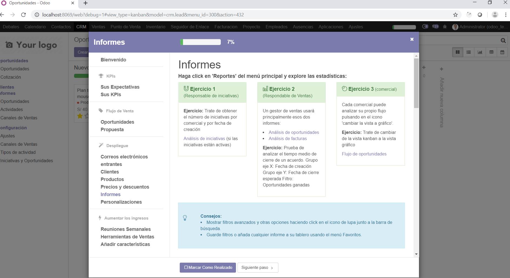

3.12. Revise las opciones disponibles para Personalizaciones
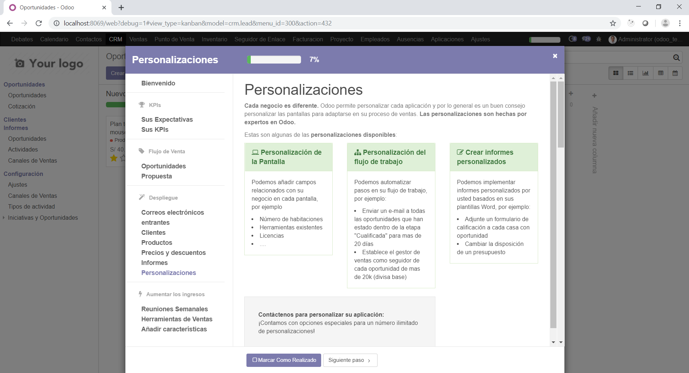

3.13. Revise las opciones disponibles en “Reuniones Semanales”
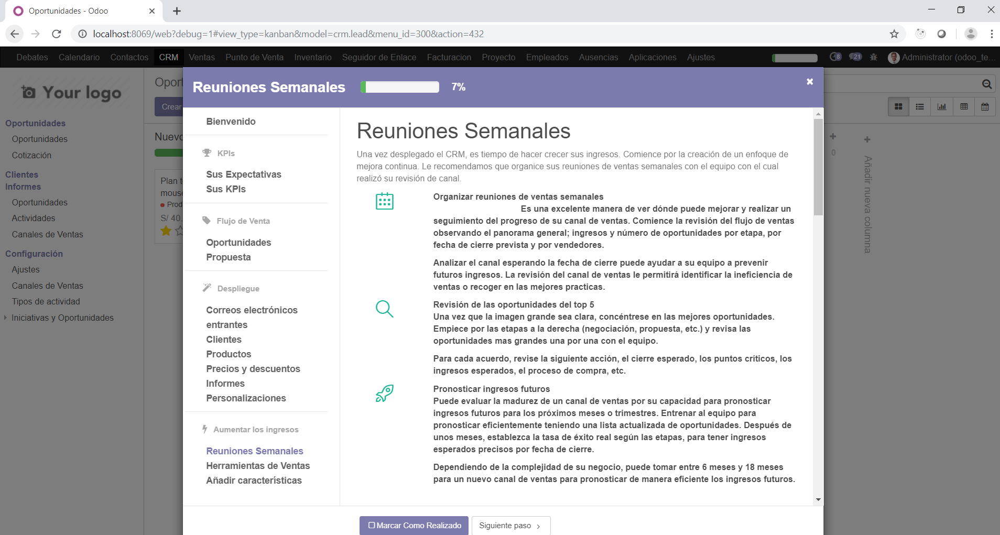

3.14. Revise las opciones disponibles en “Herramientas de Ventas”
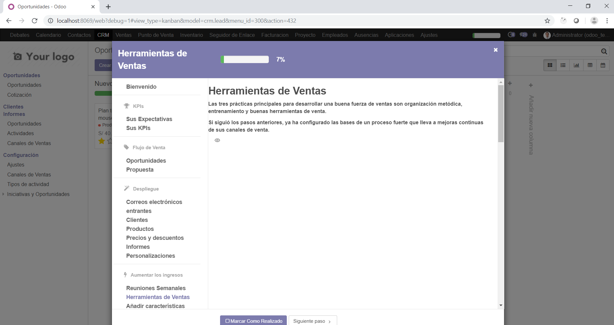

3.15. Revisar las opciones disponibles en “Añadir características”
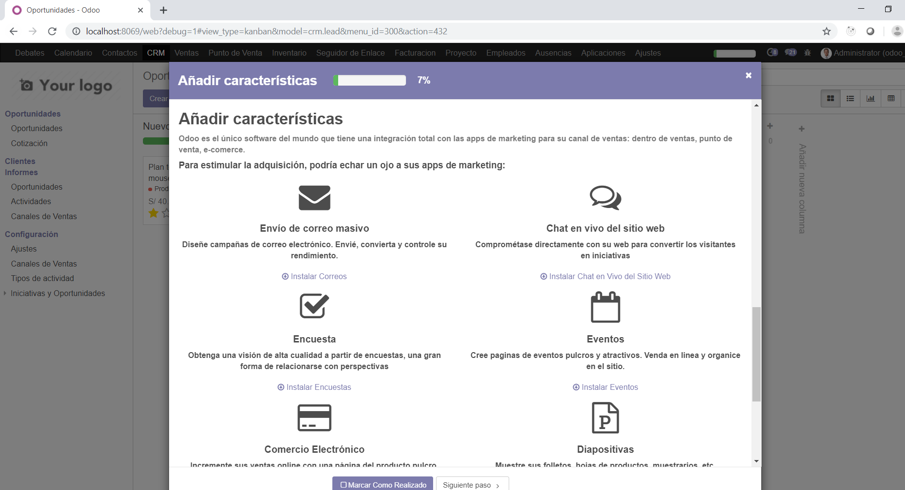

3.16. Finalmente el asistente muestra la pantalla de finalización:
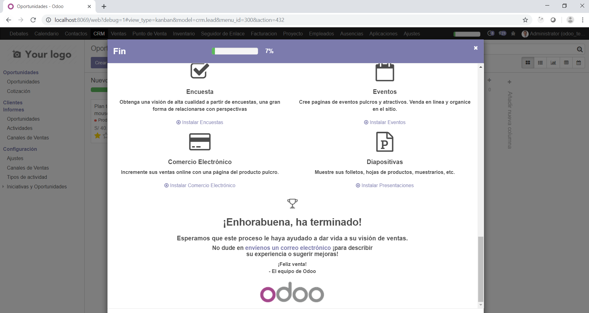

## Tarea	

1. Describa el procedimiento para importar contactos/clientes desde un archivo CSV (revise la
documentación)

2. Mejore la presentación del módulo Website instalado adicionando mayor cantidad de elementos
disponibles en su editor. Adjunte imágenes del resultado obtenido.

## Conclusiones y Observaciones

