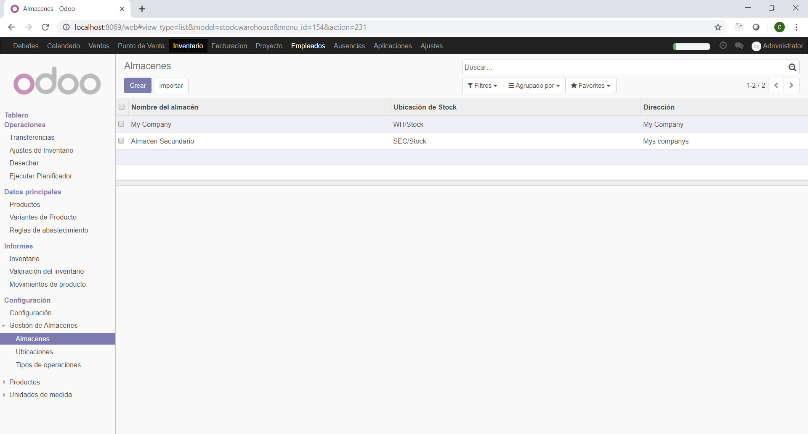
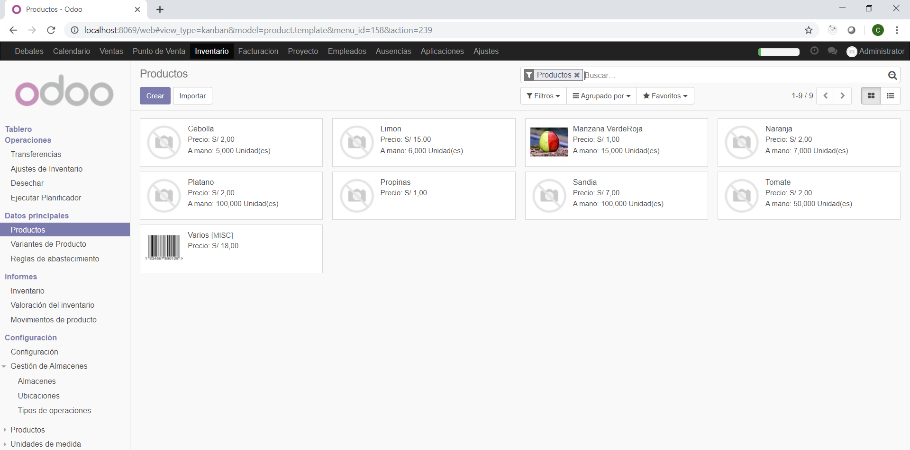
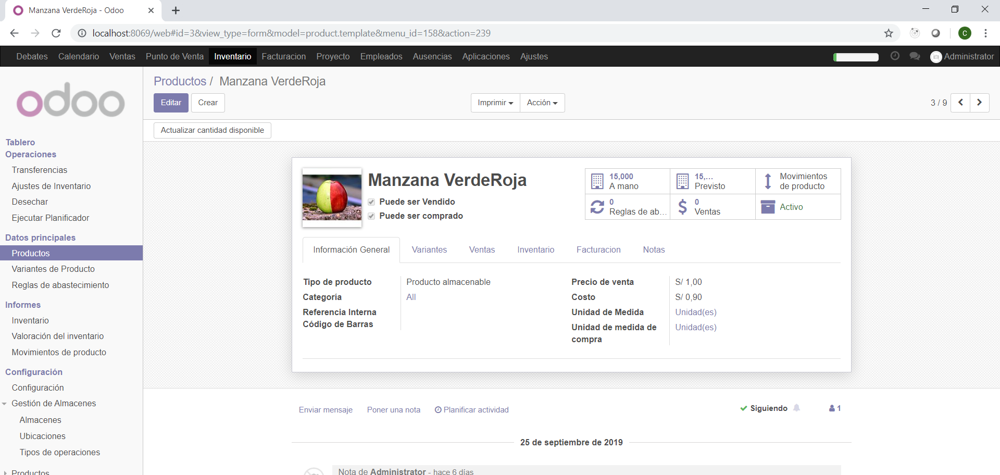
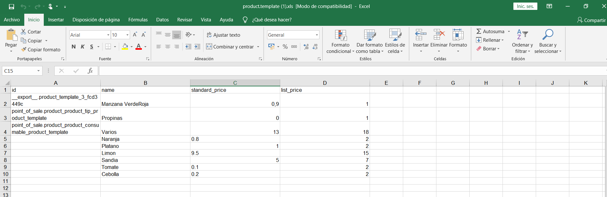

# LABORATORIO N° 04: MÓDULO LOGÍSTICO
# Este laboratorio fue echo de nuevo con una base de datos nueva

2.1. En la parte inferior de los menús, tendremos la Gestión de Almacenes, donde encontraremos la opción Almacenes. Haga click en ella.
2.11. Al darle click en Guardar y Cerrar, veremos que dicho contacto ha sido añadido a la pestaña de Contactos y Direcciones dentro de My Company. 

4.1. El menú de productos se encuentra dentro del submenú Datos principales 
6.7. Al volver a la vista de productos, veremos reflejado el ajuste al ver los nuevos stocks. 

4.6. Crearemos el producto manzana verde con los siguientes datos. 

5.6. Al abrir el Excel generado después de dar click al botón Exportar, veremos algo parecido a la siguiente imagen. Procederemos a llenar productos nuevos, como, por ejemplo: naranja, plátano, limón, etc
