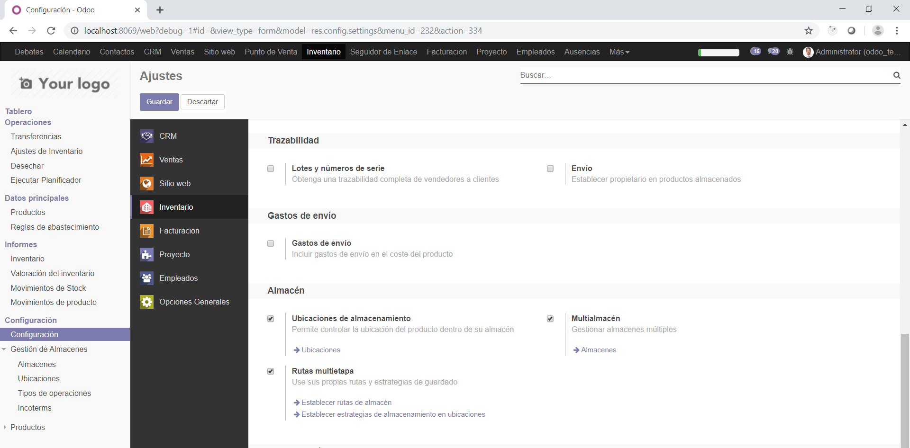
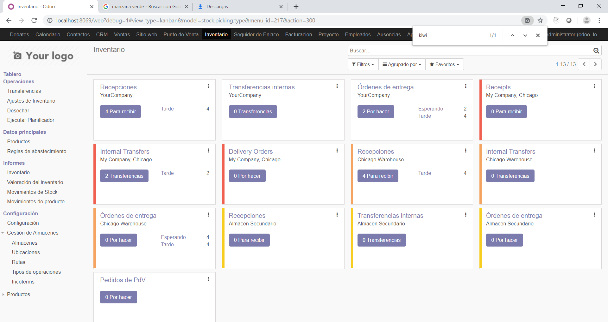

# INTEGRACIÓN DE SISTEMAS EMPRESARIALES AVANZADO 
# LABORATORIO N° 04: MÓDULO LOGÍSTICO

Alumno: Carlos Enrique Alvarez Iquiapaza
## Desarrollo

1.3. Deberá tener una vista parecida a la siguiente:

2.1. En la parte inferior de los menús, tendremos la Gestión de Almacenes, donde encontraremos la opción
Almacenes. Haga click en ella.

2.4. Ya en el menú de configuraciones, buscaremos la opción Multialmacén y la seleccionaremos. Luego
de esto, debemos dar click en Guardar en la parte superior para que el cambio sea aplicado al sistema.

2.11. Al darle click en Guardar y Cerrar, veremos que dicho contacto ha sido añadido a la pestaña
de Contactos y Direcciones dentro de My Company.

2.12. Demos click en guardar para volver a la edición del almacén. Ahora, al hacer click nuevamente
en My Company, el menú desplegable mostrará la opción de Almacén Los Incas, que es la
denominación que le dimos a nuestro almacén secundario.

2.13. Así mismo, veremos que se han creado automáticamente rutas para dicho almacén. Si uno
desea modificarlas, puede entrar directamente a ellas o incluso crear una ruta nueva

3.2. Estas son las operaciones permitidas por el sistema. Uno puede restringir a un usuario a solamente
realizar ciertas operaciones o tener acceso a todas, dependiendo del almacén en el que trabajan.
Haremos click en Recepciones del Almacén secundario para ver un poco más el detalle.

3.3. Lo interesante de los tipos de operaciones es que ya tienen personalizadas las ubicaciones de origen
y destino. En este caso, solamente indica la de destino como el almacén secundario, indicando que
esta operación permite trasladar un producto de cualquier lugar al almacén secundario.

3.4. Así mismo, cabe destacar que en Configuración encontraremos una opción de Rutas Multietapa, lo
que permite que, al realizar una operación, deba pasar por varias ubicaciones antes de considerarse
completada. Esto nos servirá para casos en los que los productos deben pasar por almacenes de
control antes de llegar a su destino.

4.10. La opción de Movimientos de producto, nos permite rastrear cada traslado de dicho producto
ya sea entre almacenes o salidas del mismo.

5.1. Hemos visto la creación de productos uno a uno, pero en la vida real esto no es práctico al inicio de
una implementación, ya que se debe tratar de importar masivamente varios productos.

5.3. Seleccionaremos todos los productos y aparecerá una opción llamada Acción, dentro de la cual
encontraremos Exportar. Haga click allí.

5.5. Para nuestro caso, seleccionaremos el formato de exportación Excel y los campos Nombre, Costo y
Precio de Venta.

5.6. Al abrir el Excel generado después de dar click al botón Exportar, veremos algo parecido a la siguiente
imagen. Procederemos a llenar productos nuevos, como, por ejemplo: naranja, plátano, limón, etc.

5.8. Al cargar el archivo, Odoo nos mostrará una vista previa de la información a importar, e incluso nos
muestra un botón para Probar importación antes de dar click en Importar. Haga click en Importar.

5.9. Vea los cambios subidos al sistema. Los productos han sido creados con los atributos indicados.
Como nota adicional, para modificarlos en masa, puede exportarlos todos con el procedimiento ya
indicado, modificar el Excel y volverlo a importar.

6.5. Modificaremos los stocks de los productos modificando el campo Cantidad real.

6.7. Al volver a la vista de productos, veremos reflejado el ajuste al ver los nuevos stocks.

7.8. Cuando hacemos click en Tablero, vemos justamente todas las operaciones en proceso. Esto es útil
para poder ver cuantas transferencias hay actualmente en camino a ser concretadas.

8.1. En el submenú informes encontraremos la opción de Valoración, la que nos permitirá valorizar en
dinero cuánto vale nuestro almacén actualmente o en la fecha seleccionada.

8.2. También encontraremos la opción Inventario, que me permite saber rápidamente cuanto stock tengo
de productos y así mismo, ver en que almacén tengo cuanto de cada uno.

8.3. Finalmente, tenemos la opción Movimientos de producto, que nos muestra los movimientos de todos
los productos en el sistema.

## Tarea	
9.1. Habilite las opciones Atributos y variantes, y Unidades de medida. Vaya a la ficha de producto e indique
las diferencias, así como adjunte imágenes de productos con varios atributos y/o unidades de medida
distintas.

9.2. Entre al menú Reglas de abastecimiento e intente crear una. Indique en que caso puede servir este
proceso.

## Conclusiones y Observaciones

Configuramos Las opciones almacen que odoo las configura por defecto

Fue necesario la realizacion de laboratorio anteriores para la compresion y realizacion de este

Nos familizaramos mas con la herramienta odoo

Vimos cuales son los pasos para la creacion de almacenes

Vimos como exportar e importar Productos a un archivo excel o tambien csv

Aprendimos a configurar la direccion de almacenes

Configuramos las propiedades de un producto mediante excel y la herramienta odoo

Vimos Para que sirver las 3 propiedades que nos da informes

