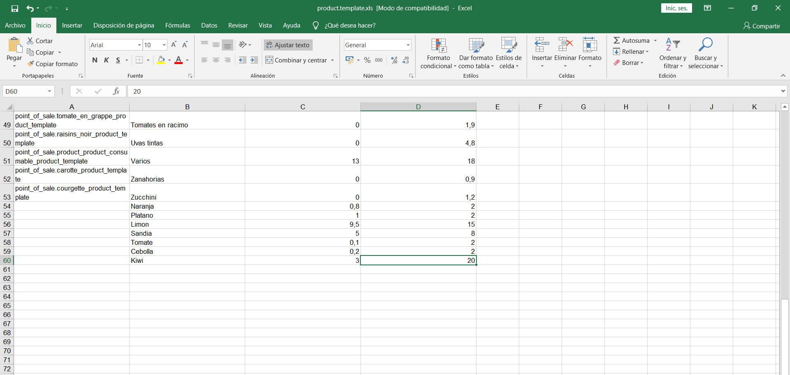

# INTEGRACIÓN DE SISTEMAS EMPRESARIALES AVANZADO 
# LABORATORIO N° 04: MÓDULO LOGÍSTICO

Alumno: Carlos Enrique Alvarez Iquiapaza
## Desarrollo

1.3. Deberá tener una vista parecida a la siguiente:

2.1. En la parte inferior de los menús, tendremos la Gestión de Almacenes, donde encontraremos la opción
Almacenes. Haga click en ella.

2.4. Ya en el menú de configuraciones, buscaremos la opción Multialmacén y la seleccionaremos. Luego
de esto, debemos dar click en Guardar en la parte superior para que el cambio sea aplicado al sistema.

2.11. Al darle click en Guardar y Cerrar, veremos que dicho contacto ha sido añadido a la pestaña
de Contactos y Direcciones dentro de My Company.

2.12. Demos click en guardar para volver a la edición del almacén. Ahora, al hacer click nuevamente
en My Company, el menú desplegable mostrará la opción de Almacén Los Incas, que es la
denominación que le dimos a nuestro almacén secundario.

2.13. Así mismo, veremos que se han creado automáticamente rutas para dicho almacén. Si uno
desea modificarlas, puede entrar directamente a ellas o incluso crear una ruta nueva

Estas son las operaciones permitidas por el sistema. Uno puede restringir a un usuario a solamente
realizar ciertas operaciones o tener acceso a todas, dependiendo del almacén en el que trabajan.
Haremos click en Recepciones del Almacén secundario para ver un poco más el detalle.

## Tarea	

## Conclusiones y Observaciones

Configuramos Las opciones almacen que odoo las configura por defecto

Fue necesario la realizacion de laboratorio anteriores para la compresion y realizacion de este

Nos familizaramos mas con la herramienta odoo

Vimos cuales son los pasos para la creacion de alamacenes

Vimos como exportar Productos a un archivo excel o tambien csv

Aprendimos a configurar la direccion de almacenes

Configuramos las propiedades de un producto
