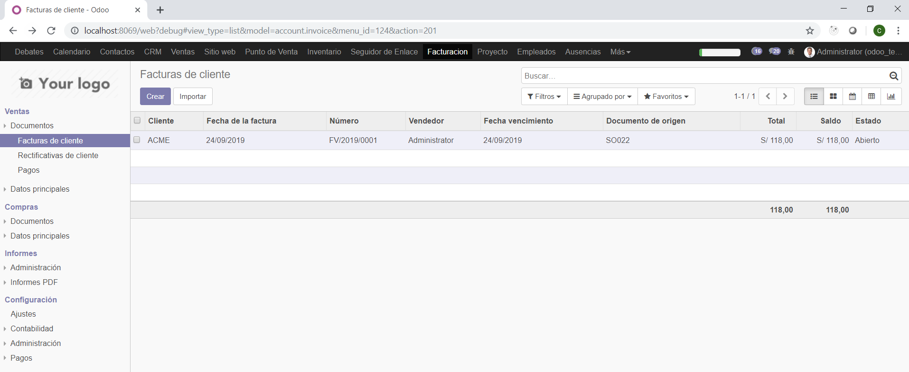
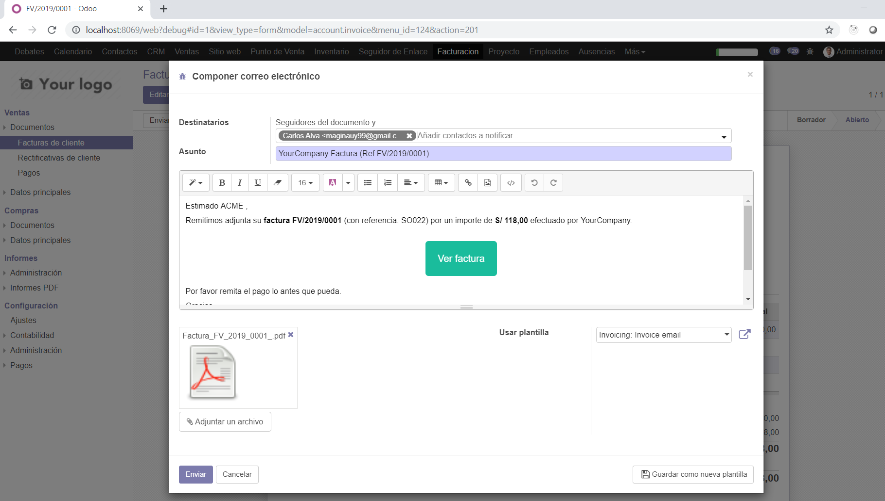
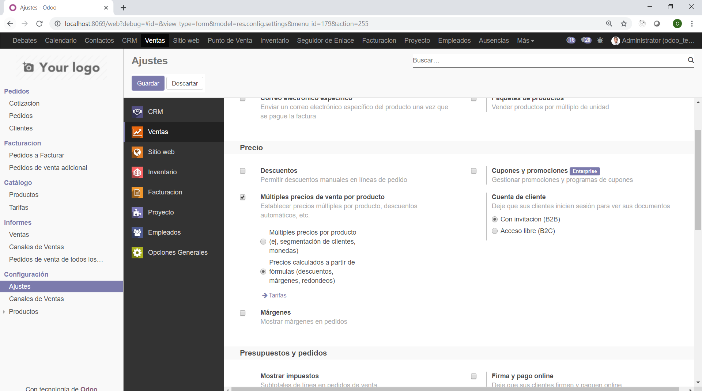

# INTEGRACIÓN DE SISTEMAS EMPRESARIALES AVANZADO 
# LABORATORIO N° 05: MÓDULO VENTAS

Alumno: Carlos Enrique Alvarez Iquiapaza
## Desarrollo   

2.5. Así mismo, podemos ir a la pestaña Otra información y modificar el almacén de donde se va a enviar
la mercadería, el vendedor asignado, la fecha del pedido, etc.

2.6. Demos click en Guardar y luego en Validar. Al validar la cotización, aparecerán nuevas opciones,
como Enviar por Email, Imprimir o incluso, Confirmar Venta (recordar que esta es solamente una
cotización para un cliente interesado en comprar)

2.8. Ahora que hemos ingresado un correo válido para el cliente (para las pruebas, ingrese un correo
personal, usaremos el correo de TECSUP más adelante), nos aparecerá un asistente de redacción
del correo.
Cada vez que intentamos enviar un correo de cierto documento, Odoo precarga una plantilla con texto
por defecto, además de adjuntar el documento en formato PDF. Esto permite flexibilidad en el tipo de
correo a enviar según el cliente deseado, e inclusive, añadir más adjuntos, digamos, un contrato o una
foto del producto.

3.1. Si vamos al módulo de Inventarios, en el tablero principal podremos ver que ahora tenemos una Orden
de Entrega. Esto es muy útil ya que sin haber hecho nada, el departamento de Ventas le comunica a
Logística que se debe hacer una entrega a un cliente.

3.3. Esto confirmará la entrega de productos al cliente. Así mismo, si vamos (dentro del módulo de
Inventario) al detalle de uno de los productos, veremos que el stock tiene dos cantidades: A mano, y
el previsto. El previsto tiene en cuenta los posibles descuentos de inventarios, en este caso, la venta
de 100 manzanas.

4.2. Demos click en Crear Factura, para registrar un comprobante a enviar al cliente.

4.3. Se abrirá una venta que nos pregunta cómo queremos facturar.

4.4. Demos click en Validar. Al igual que con otros documentos, aparecerán nuevas opciones en esta
factura. Podremos incluso crear un correo con el adjunto de la factura generada para pagar.

4.5. Al haber validado esta factura, se afectará al estado del cliente. Si buscamos en el menú Clientes,
veremos que nuestro contacto ahora tiene un indicador de cuantas ventas tiene.

4.6. Volvamos a la factura. Ahora demos click en Registrar Pago. Por defecto, se completa el monto para
toda la factura y darla por cancelada.

5.1. Hasta ahora, ha enviado dos correos pero no deben haber llegado a su bandeja. Esto es porque Odoo
utiliza un servidor smtp de correo y nosotros debemos configurarlo.
Activemos el modo Desarrollador. Luego vamos al menú Ajustes, Técnico, Email y Servidores de
correo saliente. Por ahora solamente existe un servidor de correo saliente. Lo seleccionaremos.

5.2. De click en Editar para modificar el servidor de correo. Ingresaremos la siguiente data. Reemplace el
correo por el suyo propio de Tecsup y coloque la contraseña que utiliza para iniciar sesión.

5.3. Vamos a la URL https://myaccount.google.com/security y deslicemos la pantalla hasta la opción de
Acceso de aplicaciones poco seguras. Demos click en Activar acceso.

5.4. Intentemos nuevamente enviar una factura a algún cliente. La razón por la que en el laboratorio se
solicitó que al cliente se coloque un correo personal y no el de Tecsup, es que Odoo no envía
correos si es el mismo correo del usuario que intenta enviarlo

6.3. Modificaremos la secuencia para que tenga la siguiente forma. Fíjese que estamos usando la notación
de años indicada en la parte inferior y aumentamos el tamaño de la secuencia a 5.

6.4. Guarde los cambios de la secuencia y cree otra Cotización. Verá el cambio rápidamente reflejado. Así
podemos modificar todas las secuencias del sistema, no solamente las de ventas.

7.1. Vamos a explorar las listas de precios. Para esto, debemos ir al módulo Ventas, Ajustes y activar la
opción Múltiples precios de venta por producto.

7.2. Ahora tendremos habilitado un Menú de Listas de precios. Cree una lista llamada Tarifa Mayoristas.

7.3. Proceda a crear otra cotización y juegue con el cambio de Lista de Precio (este campo no estaba
activado antes)

7.4. Así mismo, si intenta editar un cliente, verá que en la pestaña Ventas y Compras, ahora aparecerá
una opción de Lista de precios de venta. Esto significa que puedo otorgar ciertos precios a ciertos
clientes según sea necesario.

7.5. Solamente como adición, si volvemos a Ajustes y vemos la opción de Múltiples precios, vemos que
podemos incluso modificar esto para que obedezcan a fórmulas. Activemos esta opción.

8.1. Fíjese que, por defecto, en Ajustes de Ventas, está seleccionada la opción Con invitación de Cuenta
de cliente. Esto sirve para mandar invitaciones al cliente y que pueda ver un portal con el detalle de
sus pedidos.

8.3. Le diremos al sistema que este cliente tiene acceso. De click en el check al costado del correo
electrónico para poder marcarlo y activarlo.

8.4. Esto habrá enviado un mensaje al correo antes ingresado.

8.5. Haremos click en el enlace que menciona el correo para poder establecer nuestra contraseña de
cliente.

8.6. Finalmente tendremos acceso al portal del cliente.

8.7. Así mismo el cliente tendrá incluso la opción de actualizar sus propios datos, ayudándonos en la
validación de información del sistema.

## Tarea	

## Conclusiones y Observaciones

