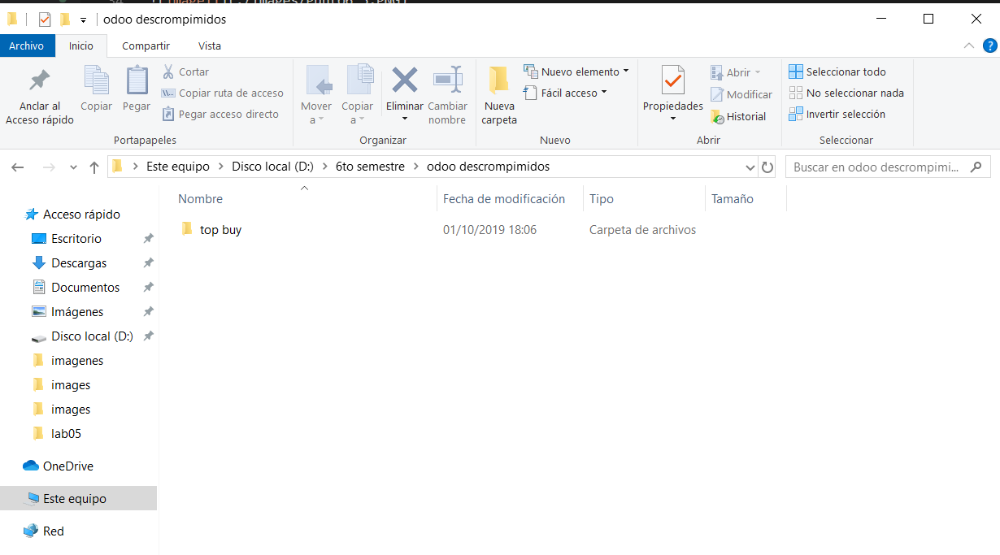

# INTEGRACIÓN DE SISTEMAS EMPRESARIALES AVANZADO 
# LABORATORIO N° 06: MÓDULO COMPRAS

# Alumno: Carlos Enrique Alvarez Iquiapaza

2.4. Podemos ver que al crear la solicitud de presupuesto se habilitan las opciones de Imprimir e incluso enviar por correo electrónico. Adjunte una imagen de cómo luce el correo en su bandeja y el adjunto generado. 

2.6. Validemos la Solicitud de presupuesto y veamos las nuevas opciones habilitadas. Se crea por defecto un envío (en caso tengamos productos que no sean servicios) y un botón para registro de las facturas del proveedor

3.1. Demos click en el botón Recibir productos. Nos llevará a un formulario de transferencia (como los vistos en el laboratorio 4 de este curso).

4.1. Proceda a crear una factura en la solicitud de presupuesto. Esta se creará en estado Borrador, así que podremos editar los datos importantes, como, por ejemplo, la referencia del proveedor (allí irá el número de la factura del proveedor), la fecha de factura, fecha de vencimiento, etc. Adjunte una imagen de lo que está dentro de la pestaña Otra información. Proceda luego a validar esta factura en borrador

4.2. La factura ahora podrá ser encontrada dentro de la Solicitud de presupuesto o incluso dentro del menú de Facturación, submenú Compras, Facturas de Proveedor. Fíjese que aparece con un monto A pagar que es precisamente la deuda que tiene la empresa con el proveedor

4.3. Si buscamos los detalles del proveedor (indique como llegó a este formulario) veremos que ahora aparece en su detalle una compra y una factura de proveedor.

4.4. Procederemos a volver a la factura y pagarla. Al igual que en el caso de las facturas de venta, veremos cómo se registra el pago en la parte inferior de la misma

5.3. Se habilitará entonces un menú de Tarifas de Compra, en el que podremos establecer distintos precios para un mismo proveedor de acuerdo a las cantidades entregadas. Adjunte una imagen con las tarifas de un proveedor para la venta de un mismo producto por unidad, docena, ciento y una tarifa válida para las mismas cantidades pero solamente válida en navidad

6.3. El Acuerdo de compra (o licitación) es muy parecido a la Solicitud de presupuesto, con la diferencia de que desde un inicio no se indica los precios a acordar ni el proveedor seleccionado. Cree una indicando una fecha límite y una fecha de entrega posteriores a la fecha actual, ya que serán las fechas hasta cuando los proveedores pueden enviar sus propuestas, y la fecha en que deben entregar preferiblemente sus propuestas

6.5. Hagamos click en Nuevo Presupuesto para ingresar una propuesta. Este ingreso se parecerá mucho a la solicitud de presupuesto que ya hemos creado antes. Proceda a crear al menos dos presupuestos más ligados a este proceso.

7.1. Si ingresamos al portal https://apps.odoo.com podremos acceder a todo el catálogo de módulos creados para Odoo. Hay todo tipo de módulo, de todo rubro, y al mismo tiempo, algunos tendrán un costo y otros serán gratuitos

7.3. Al entrar en el módulo, encontraremos su licencia, nombre técnico, descripción e inclusive las versiones para las que es compatible (encontraremos en la tienda muchos módulos compatibles con la mayoría de versiones de Odoo). Hagamos click en el botón Download for 11.0 series y procedamos a descomprimir el zip descargado. Lo descomprimiremos en una carpeta de conveniencia nuestra (por ejemplo, la carpeta llamada odoo11 dentro de nuestra unidad D). Esta carpeta será donde descomprimiremos todos nuestros módulos de terceros

7.5. Editaremos la línea con la variable llamada addons_path, le concatenaremos una coma (para separar ambas carpetas) y luego concatenaremos la ruta a nuestro directorio personalizado. Esto puede ser repetido para varias ubicaciones, Odoo no nos limita a solamente una o dos carpetas donde estén nuestros directorios. Proceda a guardar el archivo y luego reinicie el servicio de Odoo.

7.6. En modo Desarrollador, vaya al módulo de Aplicaciones, y de click en Actualizar lista de aplicaciones. Esto servirá para que Odoo pueda reconocer todo módulo nuevo en las ubicaciones antes listadas. 

# Conlusiones
apps.odoo.com nos brinda una gran cantidad de modulos para odoo que pueden ser tanto de paga como gratis

Tras la resolucion del laboratorio vimos como añadir modulos externos a Odoo

Tras la resolucion del laboratorio vimos como crear solicitudes de presupuesto y crear proveedores

Vimos como configurar el idioma y como configurar el separador decimal 

Fue necesario la resolucion de laboratorios anteriores para la comprension y resolucion de este

