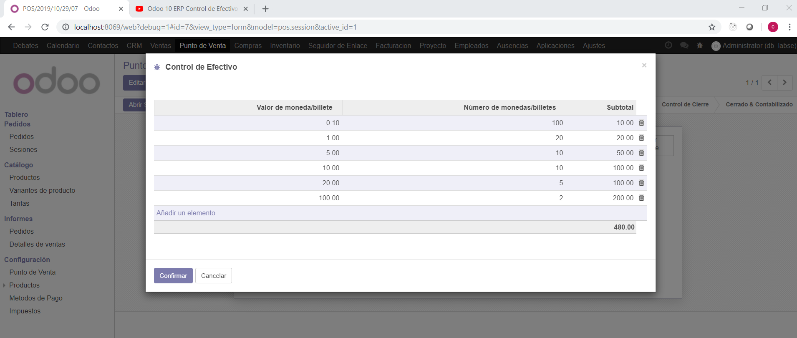
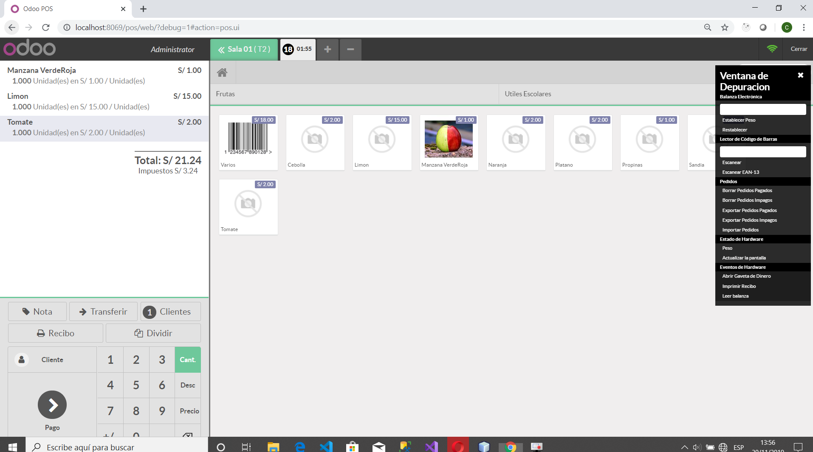

# INTEGRACIÓN DE SISTEMAS EMPRESARIALES AVANZADO 
# LABORATORIO N° 07: MÓDULO PUNTO DE VENTA

# Alumno: Carlos Enrique Alvarez Iquiapaza

2.2. La interfaz de venta es relativamente fácil de utilizar. Automáticamente incluirá todos los productos
que ya hayamos registrado en el sistema

2.3. Podemos incluso elegir entre los clientes que tengamos ya registrados con hacer click en Cliente.
Agregue un GIF de cómo se vería la creación de un cliente nuevo y su selección.

2.4. Así mismo, al dar click en el botón Pago, encontraremos una interfaz sencilla, donde elegiremos el
medio de pago y demás condiciones. Por ahora nos aparecerá solamente con Efectivo
(configuraremos más adelante otros medios como VISA o MASTERCARD)

2.5. Ingresado ya el medio de pago, de click en validar, aparecerá la impresión del ticket o comprobante
de pago.

2.6. Vamos a dar click una vez en Cerrar y luego otra vez en Confirmar (esto evita que se cierre de manera
accidental el punto de venta). Si nos dirigimos al listado de Sesiones y vemos la sesión actual veremos
el total en efectivo de las transacciones del Punto de Venta. De esta manera tendremos un control de
cierre de turno. Proceda a cerrar y validar esta sesión para iniciar otra con una nueva configuración.

3.2. Habilite la opción de Control de Precios.

3.3. Intente iniciar una nueva sesión de venta. Verá que ahora no lo redirige directamente al Punto de
Venta, sino que aparece una ventana previa. Aquí podrá configurar un Balance de Apertura.

3.4. Ahora sí, iniciaremos el Punto de Venta. Haga una venta que tenga dos medios de pago. Verá que
Odoo permite pagar de distintas formas, con efectivo, con efectivo y otros medios combinado,
solamente un medio bancarizado sin efectivo, etc. Añada imágenes de dichas ventas y comente las
combinaciones que logró.

3.7. En la parte superior del Punto de Venta (ingrese de nuevo o refresque la ventana con F5) haga click
en el nombre del usuario (Administrador o el nombre que le haya colocado) y vera una ventana de
selección de usuario. Adjunte dicha imagen.
Ahora, elija al usuario cajero y vea como se bloquea la opción Precio. Solamente un administrador
puede modificar precios con la opción habilitada Control de precios

3.8. Intente acceder como Administrador. Verá que le solicita una contraseña, que justamente será la
misma que colocamos en pasos anteriores. Verifique que ahora se habilite el botón de modificar
precios.

4.2. Proceda a crear dos categorías:
Frutas
Útiles Escolares.

4.3. Vamos a editar un producto. En la pestaña Ventas, aparecerá la opción Punto de Venta. Dentro de
ella, selecciona una de las dos categorías creadas. Repita esto con al menos 10 productos.

4.4. Refresque el Punto de Venta y vea como ahora se agregan las categorías creadas.

5.1. Crearemos un nuevo punto de venta llamado Cafetería

5.4. Ahora sí, ingrese al nuevo punto de venta. Verá las opciones de los pisos creados. Hagamos click en
el lápiz ubicado a la derecha. Este nos servirá para dibujar las mesas del restaurante. Proceda a
dibujarlas.

5.5. Para hacer un pedido, debemos estar fuera del modo de edición y hacer click en una mesa.

5.6. Tenemos un nuevo botón, que sirve para añadir notas a los pedidos. Así se le pueden añadir
personalizaciones al pedido, como por ejemplo añadir mayonesa o preparar sin sal.

5.7. También tenemos un botón de Transferir que sirve para mover el pedido de una mesa a otra. Añada
un GIF mostrando esta funcionalidad.

5.9. Ahora tenemos el botón Recibo, que sirve para imprimir la pre-cuenta (o llamada también comanda).
Esto es útil para cuando los clientes piden el total para saber cuánto han consumido.

# Conlusiones

Fue necesario instalar el modulo de venta, para establecer que tarjetas son permitidas en el establecimiento y hacer como una simulacion de un local.

Gracias al punto de venta nosotros como dueños de negocio o desarrolladores podemos maquetar o diseñar la forma de como es nuestro local en simulador de punto de venta.

Fue necesario la resolucion de laboratorios anteriores para la compresiony realizacion de este

Configuramos nuestro administrador agregando un pin para que cuando queramos entrar como admin para hacer una venta este nos pida el mismo pin como forma de seguridad 
