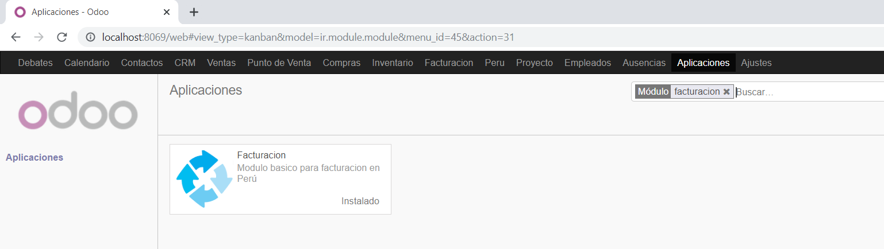
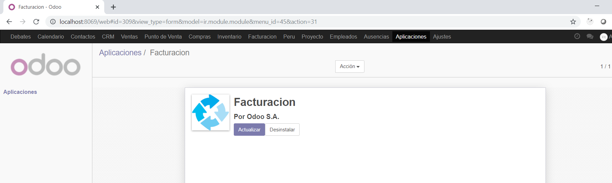
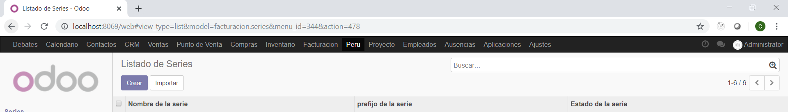
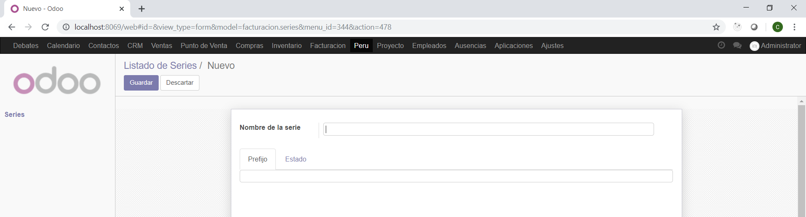
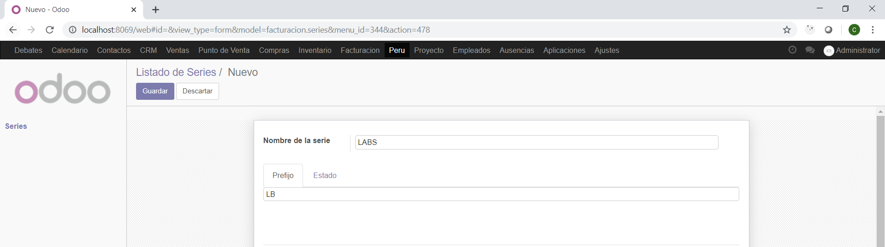
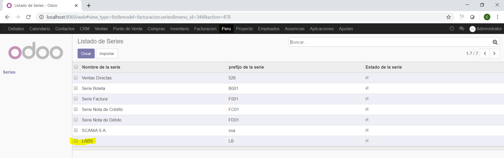
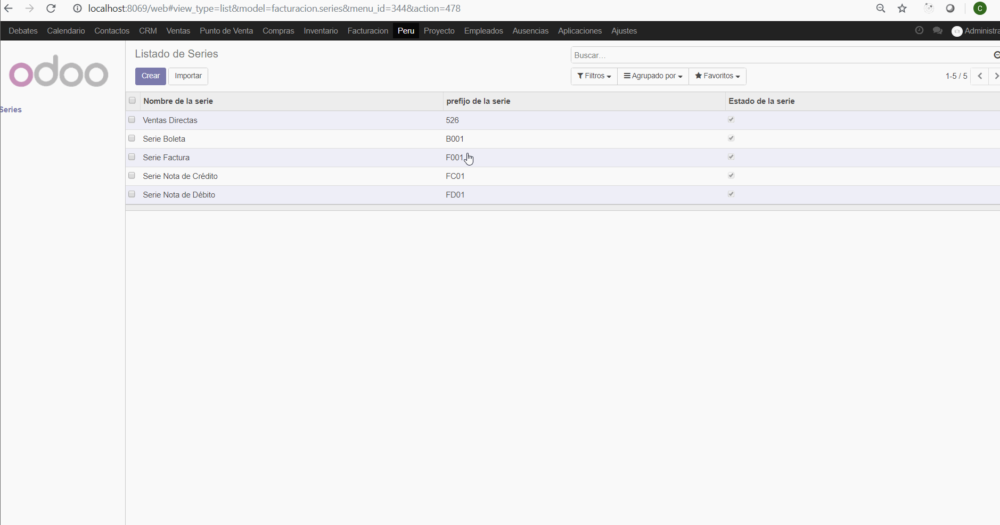
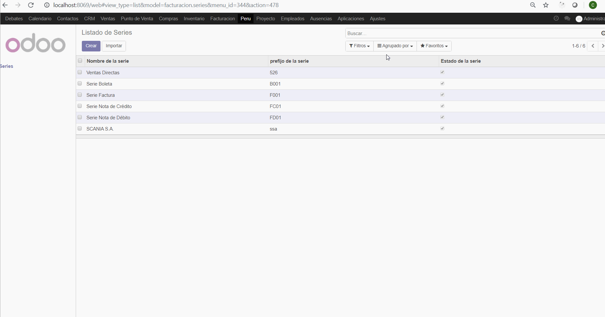
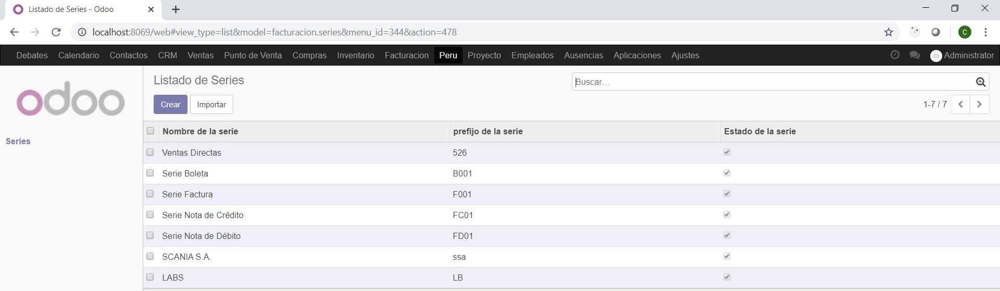
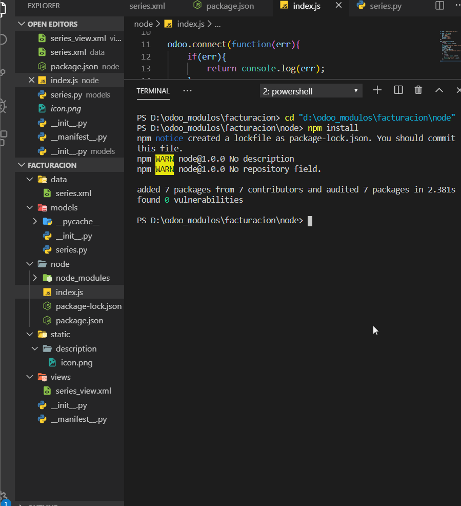

# INTEGRACIÓN DE SISTEMAS EMPRESARIALES AVANZADO 
# LABORATORIO N° 09: Módulo Básico y Herencia

# Alumno: Carlos Enrique Alvarez Iquiapaza

3.7. Procederemos a reiniciar nuestro Odoo (si está en Windows, vaya a la consola de Servicios, en el caso de Linux, utilice sudo service odoo restart) para luego Actualizar la lista de aplicaciones (recuerde que esto debe ser hecho en modo desarrollador) y luego instalaremos nuestro módulo facturación. Lo reconocerá porque tendrá nuestro ícon

4.2. Actualizaremos nuestro módulo (al solamente haber modificado xml, no se necesita recompilar Python, por lo que no se necesita reiniciar el servicio) y adjuntaremos un GIF del funcionamiento de nuestro listado con su nuevo formulario. 

5.2. Actualizaremos nuestro módulo (al solamente haber modificado xml, no se necesita recompilar Python, por lo que no se necesita reiniciar el servicio) y adjuntaremos un GIF del funcionamiento de nuestro listado con su nueva forma de búsqueda. 

6.3. Actualizaremos nuestro módulo (al haber modificado archivos python, se necesita recompilar, por lo que se necesita reiniciar el servicio) y adjuntaremos una captura de la importación de nuestra data por defecto generada por el módulo. 

7.3. Una vez creado el archivo, ejecutaremos node index.js y adjunte un GIF de la ejecución de dicho comando. Deberíamos obtener los registros en dicho modelo, demostrando que Odoo ya crea una API automática para nuestros modelos con solamente declararlos. 

# Conlusiones
La funcio Herencia nos permite nos evita la necesidad de escribir mas codigo ya que este lo que hace es pedir data de otros modelos

Tras la resolucion del laboratorio vimos como crer un api para odoo

Tras la resolucion del laboratorio fuimos capaces de crear un  pequeño modulo y  iteracturar con este por medio de odoo

Fue necesario la realizacion de laboratorios anteriores para compresion y construcion de este 

